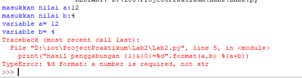
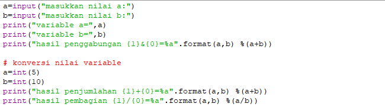

	BAHASA PEMROGRAMAN

	KONDISIONAL DAN PERULANGAN

	Dosen : Agung Nugroho, M.Kom

 
	<b>Tugas untuk memenuhi syarat penilain pada Pert-6</b>

	

                 Nama : Jose Fisto

                 NIM : 312010119

                 Kelas : TI.20 A.1

	

	<b>UNIVERSITAS PELITA BANGSA</b>

	<b>FAKULTAS TEKNIK</b>

	<b>TEKNIK INFORMATIKA</b>

	<b>TA 2020 / 2021</b>

# Lab 2

.png)

Perintah di atas merupakan tipe data, variable, dan operator.

1. `a=input("masukkan nilai a:")`
2. `b=input("masukkan nilai b:")`
3. `print("variable a=",a)`
4. `print("variable b=",b)`
5. `print("hasil penggabungan {1}&{0}=%d".format(a,b) %(a+b))`

Pada perintah di atas menyatakan, bahwa :

1. a di inputkan ke dalam tipe data string dinyatakan bahwa "masukkan nilai a:" maka a di isi dengan angka di tentukan sendiri.
2. b di inputkan ke dalam tipe data string dinyatakan bahwa "masukkan nilai b:" maka b di isi dengan angka di tentukan sendiri.
3. jika a sudah di tentukan angkanya dapat dinyatakan sebagai tipe data integer, maka variabel a ialah (angka yang sudah ditentukan sendiri). 
4. jika b sudah di tentukan angkanya dapat dinyatakan sebagai tipe data integer, maka variabel b ialah (angka yang sudah ditentukan sendiri).
5. hasil penggabungan `{1}&{0}=%d` dimana 1 merupakan data nilai b, dan 0 adalah tipe data nilai a, jika di sisa bagi-kan ke d hasil yang keluar ialah `Traceback (most recent call last):` atau selengkapnya bisa lihat pada gambar di bawah ini.

sintaks yang muncul di atas yaitu `Traceback (most recent call last):` dijelaskan adanya masalah yang perlu di perbaiki maka di telurusi pada syntax yang ada pada module yaitu pada baris ke 5, `print("hasil penggabungan {1}&{0}=%d".format(a,b) %(a+b))`. 

`TypeError: %d format: a number is required, not str` pada sintaks tersebut dapat di nyatakan sebagai `syntax error`, karena Error terjadi adanya kesalahan struktur (sintaks) pada program. Apabila, jika variabel `d` diganti dengan variabel `a` yang disesuaikan oleh intruksikan dari syntax di atas, maka pernyataan yang benar adalah : (syntax yang benar ada pada gambar di bawah ini).

1. `a=input("masukkan nilai a:")`
2. `b=input("masukkan nilai b:")`
3. `print("variable a=",a)`
4. `print("variable b=",b)`
5. `print("hasil penggabungan {1}&{0}=%a".format(a,b) %(a+b))`

Pada perintah di atas menyatakan, bahwa :

1. `a` di inputkan ke dalam tipe data string dinyatakan bahwa "`masukkan nilai a:`" maka `a` di isi dengan angka  (bisa ditentukan sendiri, misal angka `12`).
2. `b` di inputkan ke dalam tipe data string dinyatakan bahwa "`masukkan nilai b:`" maka `b` di isi dengan angka (bisa ditentukan sendiri, misal angka `4`).
3. Jika `a` sudah di tentukan angkanya dapat dinyatakan sebagai tipe data integer, maka variabel `a` diketahui angka `12`.
4. Jika b sudah di tentukan angkanya dapat dinyatakan sebagai tipe data integer, maka variabel `b` diketahui angka `4`.
5. hasil penggabungan `{1}&{0}=%a` dimana 1 merupakan data nilai b, dan 0 adalah tipe data nilai a, jika di sisa bagi-kan ke a hasil yang keluar ialah `124`.

Berikut ini adalah hasil tampilan di terminal.

.png)

## Konversi Nilai Bilangan

Pada Konversi Nilai Bilangan juga dapat dinyatakan `syntax error` dan hasil akan sama seperti sebelumnya, jika variabel `d` di ubah `a` maka kode syntax dapat di jalankan tanpa kendala error. pada penjelasan di bawah merupakan variabel `d` telah di ubah dengan variabel `a`.

Konversi Nilai Bilangan di bawah merupakan bentuk dari operasi operator dari tipe Arithmetic Operators dan Assignment Operators. 

.png)

Operasi operator di atas meliputi Operator Aritmatika, yaitu ; Pertambahan (+), dan Pembagian (/), dan diliputi Operator Penugasan, yaitu sisa bagi (%).

1. `a=int(5)`
2. `b=int(10)`
3. `print("hasil penjumlahan {1}+{0}=%a".format(a,b) %(a+b))`
4. `print("hasil pembagian {1}/{0}=%a".format(a,b) %(a/b))`

perintah atas dapat dinyatakan :

1. bahwa `a` adalah `5`, dimana `5` merupakan koefisien dari variabel `a`.
2. bahwa `b` adalah `10`, dimana `5` merupakan koefisien dari variabel `b`.
3. jika di bentukkan dalam jenis operator, maka `hasil penjumlahan {1}+{0}=%a`, dimana `{1}` adalah variabel b yang bernilai `10`, lalu di tambah `(+)` dengan `{0}` adalah variabel a yang bernilai `5`, maka hasil di sisa bagi `(%)` variabel a `=%a`, dimana a adalah hasil dari nilai variabel b di jumlahkan dengan nilai variabel a. Lalu tampilkan hasil dengan di formatkan `(a,b) %(a+b)`. Maka ouput yang keluar ialah `15`.
4. jika di bentukkan dalam jenis operator, maka `hasil penjumlahan {1}/{0}=%a`, dimana `{1}` adalah variabel b yang bernilai `10`, lalu di bagikan `(/)` dan `{0}` adalah variabel a yang bernilai `5`, maka hasil di sisa bagi `=%a`, dimana a adalah hasil dari nilai variabel b di bagikan `(/)` dengan nilai variabel a `=%a`. Lalu tampilkan hasil dengan di formatkan `(a,b) %(a/b)`. Maka ouput yang keluar ialah `0`.

Jika di tampilkan di layar terminal maka hasil dikeluarkan tertera pada gambar dibawah ini.

.png)
