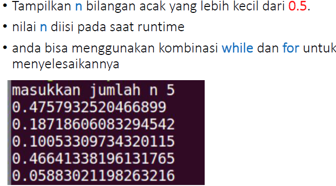

	BAHASA PEMROGRAMAN

	KONDISIONAL DAN PERULANGAN

	Dosen : Agung Nugroho, M.Kom

 
	<b>Tugas untuk memenuhi syarat penilain pada Pert-7</b>

	

                 Nama : Jose Fisto

                 NIM : 312010119

                 Kelas : TI.20 A.1

	

	<b>UNIVERSITAS PELITA BANGSA</b>

	<b>FAKULTAS TEKNIK</b>

	<b>TEKNIK INFORMATIKA</b>

	<b>TA 2020 / 2021</b>

# Latihan 1

## Perulangan Bersarang for / Nested For

Pada gambar di atas ditunjukkan bahwa hasil dari syntax yang di jalankan berupa pada gambar di bawah ini.

Keterangan syntax di atas dapat di uraikan, yaitu :

- `x = 10` dan `y = x` merupakan data integer
- `for i in range(x):` merupakan perulangan dimana data x di ulang hingga telesai
- `for j in range(y):` merupakan perulangan dimana data y melakukan perulang pada data x hingga data selesai terhitung
- `s=i+j` merupakan hasil dari perulangan dari i dengan j hingga hasil data perulangan digabungkan
- `print("{0:>5}". format(s), end='')` untuk menampilkan hasil data. Dimana `{0:>5}` memberi jarak data tertata rapih, `format(s)` menampilkan hasil dari i dengan j, `end=''` menata data secara horizontal
- `print()` menampilkan hasil dari data output `print("{0:>5}". format(s), end='')` di layar

Output atau hasil pada layar :

# Latihan 2

## Penggunaan Number

Pada gambar di atas ditunjukkan bahwa hasil dari syntax yang di jalankan berupa pada gambar di bawah ini.

Keterangan syntax di atas dapat di uraikan, yaitu :

- `import random` merupakan fungsi data number yang ada di python berfungsi menampilkan hasil data secara acak
- `x = int(input("Nilai Data: ")` merupakan data nilai integer yang nantinya nilai disebutkan bebas
- `for i in range(x):` fungsi perulangan dimana x nilai datanya akan di ulang
- `i = random.uniform(0.0, 0.5)` data i yang nantinya akan di hasilkan pada data random(teracak) dan uniform merupakan bilangan float, yang di mulai dari `0.0` sampai `0.5`

Output atau layar yang di hasilkan :

