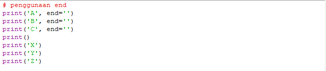
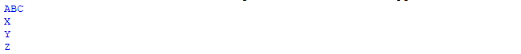
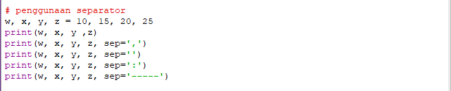
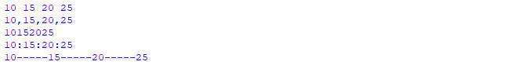

	BAHASA PEMROGRAMAN

	TIPE DATA, VARIABEL, OPERATOR

	Dosen : Agung Nugroho, M.Kom

 
	<b>Tugas untuk memenuhi syarat penilain pada Pert-6</b>

	

                 Nama : Jose Fisto

                 NIM : 312010119

                 Kelas : TI.20 A.1

	

	<b>UNIVERSITAS PELITA BANGSA</b>

	<b>FAKULTAS TEKNIK</b>

	<b>TEKNIK INFORMATIKA</b>

	<b>TA 2020 / 2021</b>

---
# Tipe Data, Variabel, Operator

Pada repository kali ini saya akan memberikan penjelasan pada Latihan pada halaman akhir dari materi Pert-6 yaitu Lab 1 dan Lab 2 yang terdiri dari Tipe Data, Variabel, Operator.

**Daftar Isi**
- [Tipe Data, Variabel, Operator](#tipe-data-variabel-operator)
- [Lab 1](#lab-1)
	- [Penggunaan End](#penggunaan-end)
	- [Penggunaan Separator](#penggunaan-separator)
	- [Penggunaan pada String Format](#penggunaan-pada-string-format)
- [Lab 2](#lab-2)
	- [Konversi Nilai Bilangan](#konversi-nilai-bilangan)

# Lab 1

Perintah `print('...')` merupakan perintah yang berfungsi untuk menunjukkan hasil pada layar baru atau output.

## Penggunaan End

`Penggunaan End` merujuk pada cetak akhir baris atau baris baru pada kalimat atau paragraf. 

 Pada perintah python di atas, untuk lebih jelasnya, yaitu :

- `print('A', end='')`, 
- `print('B', end='')`,
- `print('C', end='')`,
- `print()`
- `print('X')`
- `print('Y')`
- `print('Z')`

menunjukkan perintah bahwa :

- A,B,C adalah garis baru "`end=''`" nantinya menyambung dengan variabel lanjutannya atau kalimat. Maka hasil yang akan keluar pada Output menjadi "ABC".
- jika X, Y, Z di print maka hasil dicetak menjadi baris baru di setiap paragrafnya.

 Maka hasil dapat ditampilkan di terminal tertera gambar di bawah ini.

## Penggunaan Separator

`Penggunaan Separator` merupakan tanda pemisah dari objek yang dicetak atau menjadi satu kalimat yang mempunyai jarak penulisan setiap barisnya.

Pada perintah python di atas, untuk lebih jelasnya, yaitu :

- `w, x, y, z = 10, 15, 20, 25`
- `print(w, x, y ,z)`
- `print(w, x, y, z, sep=',')`
- `print(w, x, y, z, sep='')`
- `print(w, x, y, z, sep=':')`
- `print(w, x, y, z, sep='-----')`

menunjukkan perintah bahwa :

- Diketahui bahwa w adalah 10, x adalah 15, y adalah 20, z adalah 25.
- Jika `w, x, y, z` diprintkan maka menjadi `10 15 20 25`.
- Jika `w, x, y, z` di separatorkan dengan tanda koma `(,)` pada setiap angka merupakan dari variabel dan diprintkan maka hasil pada output menjadi `10,15,20,25`.
- Jika `w, x, y, z` di gabungkan pada setiap angka merupakan dari variabel dan diprintkan maka hasil pada output menjadi `10152025`.
-  Jika `w, x, y, z` di separatorkan dengan tanda titik dua `(:)` pada setiap angka merupakan dari variabel  dan diprintkan maka hasil pada output menjadi `10:15:20:25`.
-  Jika `w, x, y, z` di separatorkan dengan tanda strip `(-)` pada setiap angka merupakan dari variabel  dan diprintkan maka hasil pada output menjadi `10-----15-----20-----25`.

Atau hasil bisa dilihat pada terminal pada gambar dibawah ini.

## Penggunaan pada String Format

String format di gunakan sebagai konversi data ke bentuk string sebagai contoh bila 2 merupakan pangkat, dan 4 adalah angka, maka 4 pangkat 2 yaitu 16 maka konversi data tersebut termasuk jenis perhitungan eksponen (perpangkatan).

.png)

pada perintah python di atas merupakan operasi aritmatika jenis operasi perpangkatan (Eksponnen), lebih jelasnya, yaitu :

1. `print(0, 10**0)`
2. `print(1, 10**1)`
3. `print(2, 10**2)`
4. `print(3, 10**3)`
5. `print(4, 10**4)`
6. `print(5, 10**5)`
7. `print(6, 10**6)`
8. `print(7, 10**7)`
9. `print(8, 10**8)`
10. `print(9, 10**9)`
11. `print(10, 10**10)`

perintah di atas dijelaskan bahwa :

1. Jika `0` merupakan perpangkatan, maka `10` adalah angka dengan pangkat `0`. dan di cetak maka hasil yang keluar pada output adalah `1`.

2. Jika `1` merupakan perpangkatan, maka `10` adalah angka dengan pangkat `1`. dan di cetak maka hasil yang keluar pada output adalah `10`.

3. Jika `2` merupakan perpangkatan, maka `10` adalah angka dengan pangkat `2`. dan di cetak maka hasil yang keluar pada output adalah `100`.

4. Jika `3` merupakan perpangkatan, maka `10` adalah angka dengan pangkat `3`. dan di cetak maka hasil yang keluar pada output adalah `1000`.

5. Jika `4` merupakan perpangkatan, maka `10` adalah angka dengan pangkat `4`. dan di cetak maka hasil yang keluar pada output adalah `10000`.

6. Jika `5` merupakan perpangkatan, maka `10` adalah angka dengan pangkat `5`. dan di cetak maka hasil yang keluar pada output adalah `100000`.

7. Jika `6` merupakan perpangkatan, maka `10` adalah angka dengan pangkat `6`. dan di cetak maka hasil yang keluar pada output adalah `1000000`.

8. Jika `7` merupakan perpangkatan, maka `10` adalah angka dengan pangkat `7`. dan di cetak maka hasil yang keluar pada output adalah `100000000`.

9. Jika `8` merupakan perpangkatan, maka `10` adalah angka dengan pangkat `8`. dan di cetak maka hasil yang keluar pada output adalah `100000000`.

10. Jika `9` merupakan perpangkatan, maka `10` adalah angka dengan pangkat `9`. dan di cetak maka hasil yang keluar pada output adalah `1000000000`.

11. Jika 10 merupakan perpangkatan, maka 10 adalah angka dengan pangkat 10. dan di cetak maka hasil yang keluar pada output adalah `10000000000`.

Maka jika perintah dijalankan pada layar terminal hasil yang keluar ialah :

.png)

**(Gambar di bawah merupakan lanjutan perintah pada string format)**

.png)

Pada perintah di atas merupakan jenis konversi data perpangkatan (Eksponen) yang mempunyai jarak antar baris yang disejajarkan dengan yang lain, untuk lebih jelasnya, yaitu :

1. `print('{0:>3} {1:>16}'.format(0, 10**0))`
2. `print('{0:>3} {1:>16}'.format(1, 10**1))`
3. `print('{0:>3} {1:>16}'.format(2, 10**2))`
4. `print('{0:>3} {1:>16}'.format(3, 10**3))`
5. `print('{0:>3} {1:>16}'.format(4, 10**4))`
6. `print('{0:>3} {1:>16}'.format(5, 10**5))`
7. `print('{0:>3} {1:>16}'.format(6, 10**6))`
8. `print('{0:>3} {1:>16}'.format(7, 10**7))`
9. `print('{0:>3} {1:>16}'.format(8, 10**8))`
10. `print('{0:>3} {1:>16}'.format(9, 10**9))`
11. `print('{0:>3} {1:>16}'.format(10, 10**10))`

Tipe data di atas merupakan terdiri dari konversi data tipe Tuple, Dictionary, dan String.

Menyatakan bahwa :

1. Pada jarak baris pertama diberi jarak `3` baris, lalu di awali dengan angka `0`. Di baris selanjutnya setelah angka `0` diberi jarak 16 baris dimana hasil perpangkat yaitu `1` ditulis diratakan pada sebelah kanan pada baris ke 16.

2. Pada jarak baris pertama diberi jarak `3` baris, lalu di awali dengan angka `1`. Di baris selanjutnya setelah angka `1` diberi jarak `16` baris dimana hasil perpangkat yaitu `10` ditulis diratakan pada sebelah kanan pada baris ke `16`.

3. Pada jarak baris pertama diberi jarak 3 baris, lalu di awali dengan angka `2`. Di baris selanjutnya setelah angka `2` diberi jarak `16` baris dimana hasil perpangkat yaitu `100` ditulis diratakan pada sebelah kanan pada baris ke `16`.

4. Pada jarak baris pertama diberi jarak 3 baris, lalu di awali dengan angka `3`. Di baris selanjutnya setelah angka `3` diberi jarak `16` baris dimana hasil perpangkat yaitu `1000` ditulis diratakan pada sebelah kanan pada baris ke `16`.

5. Pada jarak baris pertama diberi jarak `3` baris, lalu di awali dengan angka `4`. Di baris selanjutnya setelah angka `4` diberi jarak `16` baris dimana hasil perpangkat yaitu `10000` ditulis diratakan pada sebelah kanan pada baris ke `16`.

6. Pada jarak baris pertama diberi jarak `3` baris, lalu di awali dengan angka `5`. Di baris selanjutnya setelah angka `5` diberi jarak `16` baris dimana hasil perpangkat yaitu `100000` ditulis diratakan pada sebelah kanan pada baris ke `16`.

7. Pada jarak baris pertama diberi jarak `3` baris, lalu di awali dengan angka `6`. Di baris selanjutnya setelah angka `6` diberi jarak `16` baris dimana hasil perpangkat yaitu `1000000` ditulis diratakan pada sebelah kanan pada baris ke `16`.

8. Pada jarak baris pertama diberi jarak `3` baris, lalu di awali dengan angka `7`. Di baris selanjutnya setelah angka `7` diberi jarak `16` baris dimana hasil perpangkat yaitu `10000000` ditulis diratakan pada sebelah kanan pada baris ke `16`.

9. Pada jarak baris pertama diberi jarak `3` baris, lalu di awali dengan angka `8`. Di baris selanjutnya setelah angka `8` diberi jarak `16` baris dimana hasil perpangkat yaitu `100000000` ditulis diratakan pada sebelah kanan pada baris ke ``16``.

10. Pada jarak baris pertama diberi jarak `3` baris, lalu di awali dengan angka `9`. Di baris selanjutnya setelah angka `9` diberi jarak `16` baris dimana hasil perpangkat yaitu `1000000000` ditulis diratakan pada sebelah kanan pada baris ke ``16``.

11. Pada jarak baris pertama diberi jarak `3` baris, lalu di awali dengan angka `10`. Di baris selanjutnya setelah angka `10` diberi jarak `16` baris dimana hasil perpangkat yaitu `10000000000` ditulis diratakan pada sebelah kanan dari baris ke ``16``.

Jika perintah di atas dijalankan maka layar yang ditampilkan, yaitu :

.png)

# Lab 2

.png)

Perintah di atas merupakan tipe data, variable, dan operator.

1. `a=input("masukkan nilai a:")`
2. `b=input("masukkan nilai b:")`
3. `print("variable a=",a)`
4. `print("variable b=",b)`
5. `print("hasil penggabungan {1}&{0}=%a".format(a,b) %(a+b))`

Pada perintah di atas menyatakan, bahwa :

1. a di inputkan ke dalam tipe data string dinyatakan bahwa "masukkan nilai a:" maka a di isi dengan angka di tentukan sendiri.
2. b di inputkan ke dalam tipe data string dinyatakan bahwa "masukkan nilai b:" maka b di isi dengan angka di tentukan sendiri.
3. jika a sudah di tentukan angkanya dapat dinyatakan sebagai tipe data integer, maka variabel a ialah (angka yang sudah ditentukan sendiri). 
4. jika b sudah di tentukan angkanya dapat dinyatakan sebagai tipe data integer, maka variabel b ialah (angka yang sudah ditentukan sendiri).
5. hasil penggabungan `{1}&{0}=%a` dimana 1 merupakan data nilai b, dan 0 adalah tipe data nilai a, jika di sisa bagi-kan ke a hasil yang keluar ialah `1015`.

Berikut ini adalah hasil tampilan di terminal.

.png)

## Konversi Nilai Bilangan

Konversi Nilai Bilangan di bawah merupakan bentuk dari operasi operator dari tipe Arithmetic Operators dan Assignment Operators. 

.png)

Operasi operator di atas meliputi Operator Aritmatika, yaitu ; Pertambahan (+), dan Pembagian (/), dan diliputi Operator Penugasan, yaitu sisa bagi (%).

1. `a=int(5)`
2. `b=int(10)`
3. `print("hasil penjumlahan {1}+{0}=%d".format(a,b) %(a+b))`
4. `print("hasil pembagian {1}/{0}=%d".format(a,b) %(a/b))`

perintah atas dapat dinyatakan :

1. bahwa a adalah 5, dimana 5 merupakan koefisien dari variabel a.
2. bahwa b adalah 10, dimana 5 merupakan koefisien dari variabel b.
3. jika di bentukkan dalam jenis operator, maka `hasil penjumlahan {1}+{0}=%d`, dimana 1 adalah variabel b yang bernilai 10, lalu di tambahkan `(+)` dan 0 adalah variabel a yang bernilai 5, maka hasil di sisa bagi `=%d`, dimana d adalah hasil dari nilai variabel b di jumlahkan dengan nilai variabel a. Lalu tampilkan hasil dengan di formatkan `(a,b) %(a+b)`. Maka ouput yang keluar ialah `15`.
4. jika di bentukkan dalam jenis operator, maka `hasil penjumlahan {1}/{0}=%d`, dimana 1 adalah variabel b yang bernilai 10, lalu di bagikan `(/)` dan 0 adalah variabel a yang bernilai 5, maka hasil di sisa bagi `=%d`, dimana d adalah hasil dari nilai variabel b di bagikan `(/)` dengan nilai variabel a. Lalu tampilkan hasil dengan di formatkan `(a,b) %(a/b)`. Maka ouput yang keluar ialah `15`.

Jika di tampilkan di layar terminal maka hasil dikeluarkan tertera pada gambar dibawah ini.

.png)
